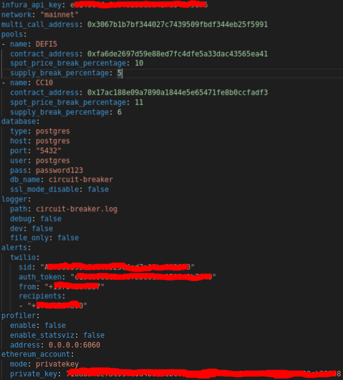

# Configuration File

As mentioned in the README, configuration of `circuit-breaker` is done using a YAML file. The CLI includes a command to generate a template configuration file with all vlaues filled in to showcase what the configuration file looks like:


```yaml
infura_api_key: INFURA-KEY
network: mainnet
multi_call_address: 0x3067b1b7bf344027c7439509fbdf344eb25f5991
pools:
- name: DEFI5
  contract_address: 0xfa6de2697d59e88ed7fc4dfe5a33dac43565ea41
  spot_price_break_percentage: 10
  supply_break_percentage: 5
- name: CC10
  contract_address: 0x17ac188e09a7890a1844e5e65471fe8b0ccfadf3
  spot_price_break_percentage: 11
  supply_break_percentage: 6
database:
  type: sqlite
  host: localhost
  port: "5432"
  user: user
  pass: pass
  db_name: circuit-breaker
  db_path: ""
  ssl_mode_disable: false
logger:
  path: circuit-breaker.log
  debug: true
  dev: true
  file_only: false
  fields: {}
alerts:
  twilio:
    sid: CHANGEME-SID
    auth_token: CHANGEME-AT
    from: CHANEME-FROM
    recipients:
    - RECIPIENT-1
profiler:
  enable: false
  enable_statsviz: false
  address: localhost:6060
ethereum_account:
  mode: privatekey
  key_file_path: CHANGEME-PATH
  key_file_password: CHANGEME-PASS
  private_key: CHANGEME-PK
  gas_price:
    minimum_gwei: "100000000000"
    gwei_multiplier: "3"
```

An example of what a production configuration file would look like is displayed in the following screenshot, note that unused values are omitted:



Below you'll find explanations on all the configuration file settings

# infura_api_key

This is your Infura API key. During testing monitoring two index pools, a free tier account was enough. You may be able to use a free tier account for monitoring three or four index pools but I havent tested this.

# network

The ethreum network to use, at the moment the only supported RPC provider is Infura, so it will need to be a valid network as supported by Infura. It is case sensitive, so "mainnet", "ropsten", "rinkeby", etc...

# multi_call_address

This is the address of the "SimpleMultiCall" smart contract

# pools

This is an array of values, with each element of the array starting with `- name: ...`, and is used to configure the pools `circuit-breaker` monitors. Each element of the array takes the following values

* `name`
  * This is the name of the index pool
* `contract_address`
  * This is the address of the index pool smart contract
* `spot_price_break_percentage`
  * The decrease in spot price between two blocks that should break a circuit
* `supply_break_percentage`
  * The increase/decrease in total supply between two blocks that should break a circuit

# database

This provides configuration over the database used, and accepts the following values:

* `type`
  * Indicates the database type, can be `sqlite` or `postgres` please note that `sqlite` should only be used during testing
* `host`
  * Only used when `type` is set to `postgres`, you should have it set to `postgres`
* `port`
  * Only used when `type` is set to `postgres`, you should leave it set to `5432`
* `user`
  * Only used when `type` is set to `postgres`, must match what is set in the docker compose file
* `pass`
  * Only used when `type` is set to `postgres`, must match what is set in the docker compose file
* `db_name`
  * Indicates the name of the database
* `db_path`
  * Only used when `type` is set to `sqlite` specifies the path of the sqlite file
* `ssl_mode_disable`
  * Only used when `type` is set to `postgres`, you should it leave it set to `false`

# logger

This provides configuration over the zap logger used by the `block-listener` and `contract-watcher` services.

* `path`
  * The path the log file is stored in within the docker container
* `debug`
  * If set to `true` will enable debug logs (this will be very noisy)
* `dev`
  * If set to true, makes logs more human readable
* `file_only`
  * If set to true, logs are only stored in a file. Recommended to leave it at `false`
* `fields`
  * key-value pairs for extra logging infromation

# alerts

This provides configuration over circuit breaking alerts. The only supported delivery method is `sms` through twilio

## twilio

Uses the [Twilio](https://www.twilio.com) for SMS notifications.

* `sid`
  * Twilio account sid
* `auth_token`
  * Twilio auth token
* `from`
  * The phone number that twilio generates for you
* `recipients`
  *  An array of phone numbers to send alerts to

# profiler

Used to assist with profiling `block-listener` and `contract-watcher`, when enabled will cause a performance hit of around 3% -> 5%

* `enable`
  * Enables standard profiling exposed via the http `/debug/pprof`, recommend to be set to `false`
* `enable_statsviz`
  * Enables fancy graphs for profiled information, recommend to be set to `false`
* `address`
  * The address to expose pprof handlers on

# ethereum_account

This provides configuration over the ethereum account used to sign transactions, as well as a rudimentary gas price selection "algorithm" (i use the word algorithm loosely as its basically a glorified if/else statement with some multiplication)

* `mode`
  * The ethereum account mode to use, can be one of `privatekey` or `keyfile`
* `key_file_path`
  * If `mode` is set to `keyfile` the path for the keyfile **inside** the docker container
* `key_file_password`
  * If `mode` is set to `keyfile` the password used to unlock the keyfile
* `private_key`
  * If `mode` is set to `privatekey` the hex encoded private key to use

## gas_price

This section is used to control how we determine the gas prices used when broadcasting circuit break transactions. The underlying gas price determination is done using go-ethereums "gasprice oracle" which is usually configured to sample gas prices over the last 20 blocks, and provide an estimate based off that sampling.

* `minimum_gwei`
  * If the gas price returned by go-ethereum is smaller than the gwei value specified here we override it with the `minimum_gwei` amount.
  * This value **must** be in gwei denomination, and if it isn't incorrect gas prices will be set
* `gwei_multiplier`
  * Regardless of whatever gas price the oracle provides, or `minimum_gwei` is set to, we multiply its value by this number. This is done to ensure we can get next block-inclusion for the circuit break transaction
  * Generally speaking this should be set to 3, as anything less will likely be insufficient during high gas price periods
  * This value must be a whole-number