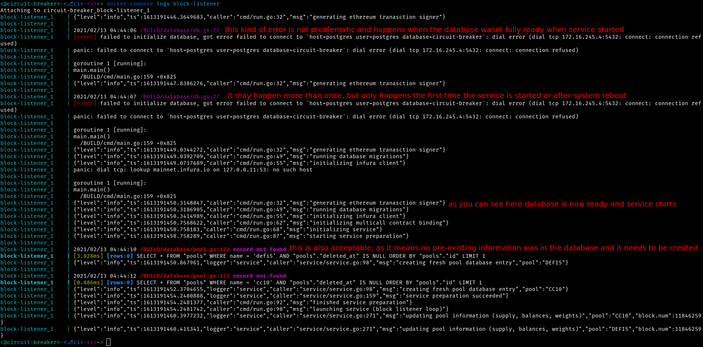

# circuit-breaker

`circuit-breaker` is a circuit breaker bot for Indexed Finance that can trigger circuit breaks based off of total supply increase/decrease of the tokens that are part of a pool (ie CRV total supply increasing/decreasing), or due to excessive price fluctuations (specifically price decreases) from token swaps.

# Architecture

For information on how `circuit-breaker` is designed read [ARCHITECTURE.md](./ARCHITECTURE.md)

# Usage

To run `circuit-breaker` in production you will need to install `docker` and `docker-compose`. This can be done on Ubuntu hosts with `sudo apt install docker docker-compose`. You will also want to fetch the latest release of the docker image from [github releases](https://github.com/bonedaddy/circuit-breaker/releases). Although the service can be run on probably any Linux distribution, for security purpsoes you should use Ubuntu, preferrably an LTS release such as `Ubuntu 20.04 LTS`.

For information on best practices when running `circuit-breaker` in production see [SECURITY.md](./SECURITY.md)

## Installation

The installation examples here assume a latest release of `v0.0.9`, please substitute all `v0.0.9` references with the latest release at time of installation. It also assumes you have already installed docker on the host you will be running `circuit-breaker` on.

On your main desktop/laptop/faptop navigate to `https://github.com/bonedaddy/circuit-breaker/releases/tag/v0.0.9` using a browser authenticated with GitHub using a user account that has permissions to view the repository. You'll want to download the following files:

* `circuit-breaker-docker_v0.0.9.tar.sha256` (docker image checksum)
* `circuit-breaker-docker_v0.0.9.tar` (docker image)
* `circuit-breaker-v0.0.9.sha256` (cli checksum)
* `circuit-breaker-v0.0.9` (cli)

Once these have downloaded you can verify the checksum with the following one-liner and ensure that `OK` is outputted to your console. If `ERROR` is displayed then you likely have a corrutpted download and want to try again:


Docker image verification:

```
$> WANT_SHA=$(cat circuit-breaker-docker_v0.0.9.tar.sha256 | awk '{print $1}'); HAVE_SHA=$(sha256sum circuit-breaker-docker_v0.0.9.tar | awk '{print $1}'); if [[ "$WANT_SHA" == "$HAVE_SHA" ]]; then echo "OK" ; else "ERROR" ; fi
```

CLI verification:

```
$> WANT_SHA=$(cat circuit-breaker-v0.0.9.sha256 | awk '{print $1}'); HAVE_SHA=$(sha256sum circuit-breaker-v0.0.9 | awk '{print $1}'); if [[ "$WANT_SHA" == "$HAVE_SHA" ]]; then echo "OK" ; else "ERROR" ; fi
```

Transfer the docker image (`circuit-breaker-docker_v0.0.9.tar`) to the host you will be running `circuit-breaker` on:

```shell
$> scp circuit-breaker-docker_v0.0.9.tar  user@host
```

After this has transferred ssh to the target host and load the docker image with the following command:

```shell
$> docker image load < circuit-breaker-docker_v0.0.9.tar
```

After this you will have installed `circuit-breaker` onto the target host, and will now be ready for configuring the service. 

## Configuration

For this you'll want to use the precompiled binary (`circuit-breaker-v0.0.9`) to generate the configuration file used by the service. You can change the name and path the file is written to using `--config.path`, however it defaults to the current working directory in a file named `circuit-breaker.yaml`. For simplicity sake all references to the precompiled binary from here on out will be `circuit-breaker`. For documentation on the settings of the configuration file see [CONFIG_DOC.md](./CONFIG_DOC.md)

Please note that all corresponding files (yaml config file, key file, docker compose file, etc...) must be placed in the same directory on the target host.

### File Generation

```shell
$> ./circuit-breaker config # generates a template config file ./circuit-breaker.yaml
# OR
$> ./circuit-breaker --config.path /tmp/kek.yaml config # generates a template config file /tmp/kek.yaml
```

You'll want to transfer this over to the target host.

### Ethereum Account

An ethereum account is needed to sign the transactions which break the circuits of an IndexPool. There are two ways of supplying this to `circuit-breaker` either through a hex encoded private key, or a keyfile. You can either use a hex encoded private key you already have, or generate one like so:

```shell
$> ./circuit-breaker account-new --mode privatekey
```

Alternatively if you want to use a keyfile you may use one generated by geth (`geth account new`) or use `circuit-breaker` like so:

```shell
$> ./circuit-breaker account-new --mode keyfile --key.file_dir . --key.file_pass password123 # key.file_dir specifies the location to store the key file
```

If you're using a keyfile make sure to transfer this to the target host, however if you are using a hex encoded private key you can just paste this into the configuration file.


### Docker

For management of the `circuit-breaker` service `docker-compose` is used. There is a slight difference between format of the docker compose files depending on whether or not you are using a hex encoded private key, or a keyfile for the ethereum account. Regardless of whatever format you use the docker compose configuration must be stored in a file named `docker-compose.yml`

#### Hex Encoded Private Key

Make sure you cahnge the `POSTGRES_USER` and `POSTGRES_PASSWORD` fields to more secure values. You will want to make sure these same values are stored in the `circuit-breaker` yaml configuration file.

```yaml
version: "3.5"
services:
  contract-watcher:
    image: bonedaddy/circuit-breaker:v0.0.9
    command: "contract-watcher"
    depends_on:
      - postgres
      - block-listener
    volumes: 
      - ./circuit-breaker.yaml:/circuit-breaker.yml
  block-listener:
    image: bonedaddy/circuit-breaker:v0.0.9
    restart: always
    command: "--db.migrate block-listener"
    depends_on:
      - postgres
    volumes: 
      - ./circuit-breaker.yaml:/circuit-breaker.yml
  postgres:
    image: postgres:10.12
    restart: always
    environment:
      POSTGRES_DB: "circuit-breaker"
      POSTGRES_USER: "postgres"
      POSTGRES_PASSWORD: "password123"
```

#### Key File

Note the very long `UTC-xxxx` value will depend on whatever is returned by the key file generation step. Make sure you cahnge the `POSTGRES_USER` and `POSTGRES_PASSWORD` fields to more secure values. You will want to make sure these same values are stored in the `circuit-breaker` yaml configuration file.

```yaml
version: "3.5"
services:
  contract-watcher:
    image: bonedaddy/circuit-breaker:v0.0.9
    command: "contract-watcher"
    depends_on:
      - postgres
      - block-listener
    volumes: 
      - ./circuit-breaker.yaml:/circuit-breaker.yml
      - ./UTC--2021-02-10T10-20-05.869581969Z--54f0b946340efb1ba43e2b841616ac003c296eef:/UTC--2021-02-10T10-20-05.869581969Z--54f0b946340efb1ba43e2b841616ac003c296eef
  block-listener:
    image: bonedaddy/circuit-breaker:v0.0.9
    restart: always
    command: "--db.migrate block-listener"
    depends_on:
      - postgres
    volumes: 
      - ./circuit-breaker.yaml:/circuit-breaker.yml
      - ./UTC--2021-02-10T10-20-05.869581969Z--54f0b946340efb1ba43e2b841616ac003c296eef:/UTC--2021-02-10T10-20-05.869581969Z--54f0b946340efb1ba43e2b841616ac003c296eef
  postgres:
    image: postgres:10.12
    restart: always
    environment:
      POSTGRES_DB: "circuit-breaker"
      POSTGRES_USER: "postgres"
      POSTGRES_PASSWORD: "password123"
```

## Starting Circuit-Breaker

For this step you'll want to run this from within the directory on your target host that you are storing the various file (config file, docker compose file, etc...):

```shell
$> docker-compose up -d
```

Thats it! Wait a few seconds (5 -> 10) and run `docker-compose ps` which should show output similar to the following. You'll want to make sure that in the `State` column the value `Up` is displayed.

```shell
$> docker-compose ps
           Name                          Command               State           Ports         
---------------------------------------------------------------------------------------------
circuit-breaker_block-listener_1     /bin/circuit-breaker --config.pat ...   Up      0.0.0.0:6061->6060/tcp
circuit-breaker_contract-watcher_1   /bin/circuit-breaker --config.pat ...   Up      0.0.0.0:6060->6060/tcp
circuit-breaker_postgres_1           docker-entrypoint.sh postgres    Up      5432/tcp              
```

If you want to inspect logs of the various services you can run the following:

```shell
# view block-listener logs
$> docker-compose logs block-listener
# view contract-watcher logs
$> docker-compose logs contract-watcher
# view postgresql logs
$> docker-compose logs postgres
```

Example output that you may see (including some normal errors) are indicated in the screenshot below:




